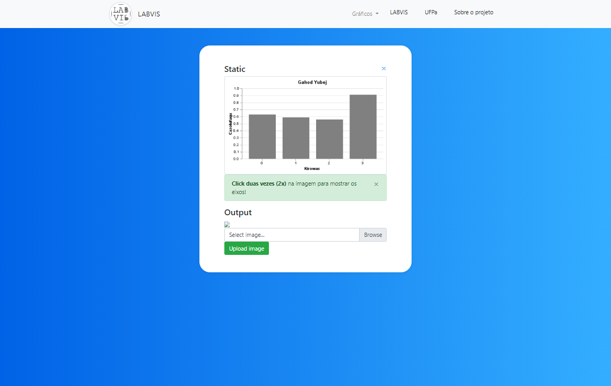

# Proposta e Avaliação de Templates de descrição Textual para vocalização
Intitulado Proposta e Avaliação de Templates de descrição Textual para vocalização de gráficos de barras, este projeto tem como objetivo criar uma aplicação web a qual visa extrair dados das imagens anexadas(upload) a aplicação web.

## Preview
##### Index page

##### Interact page

## Download and Installation
* To begin using this application, install all of the following commads to get started:
* [Download Python 3.8.3](https://www.python.org/ftp/python/3.8.3/python-3.8.3.exe)
* > pip install flask
* > pip install flask-sqlalchemy
* > pip install opencv-python
* > pip install Flask-Migrate
* > pip install Flask-Script
* [The Bootstrap's template repository](https://github.com/nolovedeepdev/flask/tree/master/app/templates)

## Usage

### Basic
Após as instalações, citadas posteriormente, execute o comando para executar a aplicação
> python run.py

### Mapa das páginas
A página Index é direcionada a apresentação do projeto, seu github e devidas apresentações a universidade e laboratório 
## Bugs and Issues

## About

Matheus Antônio Castro

## Copyright and License
* Universidade Federal do Pará
* Laboratório Visualização, Interação e Sistemas Inteligentes.
* Laboratório Visualização, Interação e Sistemas Inteligentes.
* The MIT License (MIT) - Copyright (c) 2013-2019 Blackrock Digital LLC
