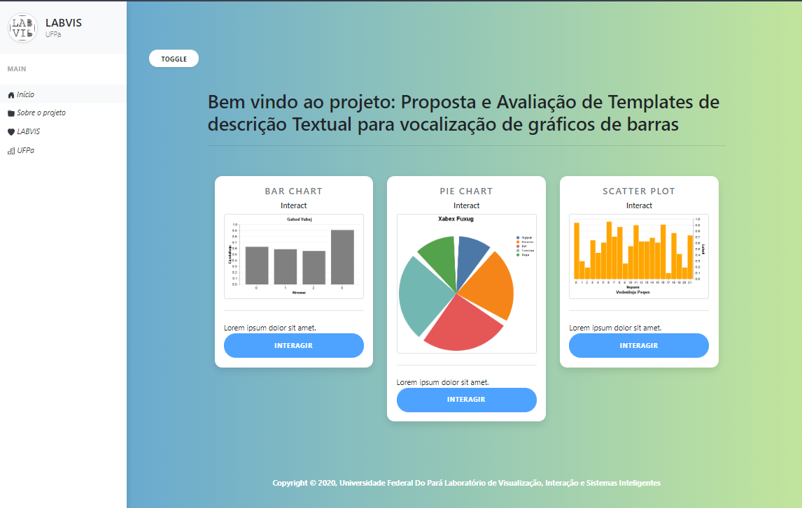

# Proposta e Avaliação de Templates de descrição Textual para vocalização

## Introdução 

Intitulado Proposta e Avaliação de Templates de descrição Textual para vocalização de gráficos de barras, este projeto tem como objetivo criar uma aplicação web a qual visa extrair dados das imagens anexadas(upload) a aplicação web.

## Tecnologias

Python 3.8 Flask framework
Opencv (python)

## Instalação

> pip install flask
> pip install flask-sqlalchemy

## Autores

Matheus Antônio Castro

## License

The MIT License (MIT) - Copyright (c) 2013-2019 Blackrock Digital LLC